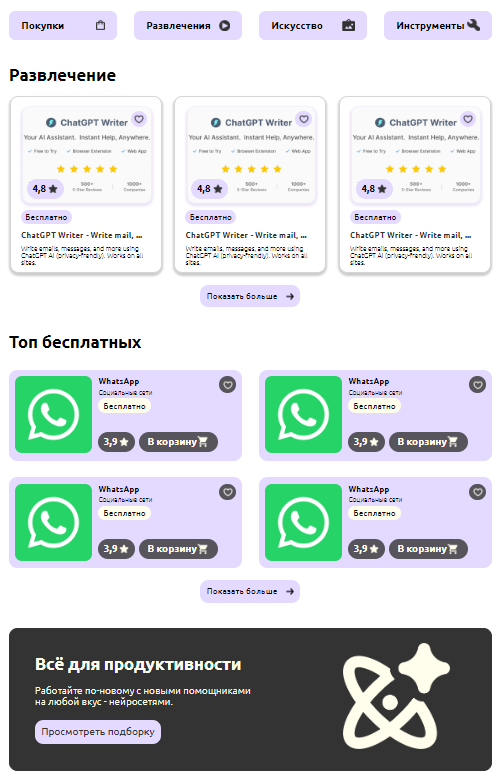

## AppSphere
Верстка веб приложения

## Установка
- Клонирование репозитория
- Установка зависимостей: npm install
- Запуск сервера: npm start

## Версии

- "react": "^18.3.1",

## Файлы компонентов
- /src/components/Auth - компоненты для авторизации и регистрации

- /src/components/Buttons - кастомные кнопки

- /src/components/Cards - карточки для вывода инфорцации о категории

- /src/components/Catalog - каталог для веб-приложения

- /src/components/CategoryOverview - Станица с подробным описанием.

- /src/components/Header - header для сайта

- /src/components/Footer - footer для сайта

- /src/components/Home - главная страница сайта

- /src/components/images - папка для хранения фото

- /src/components/Profile - страница профиля пользователя

- /src/components/SocialMediaCategory - страница с категориями социальных сетей

